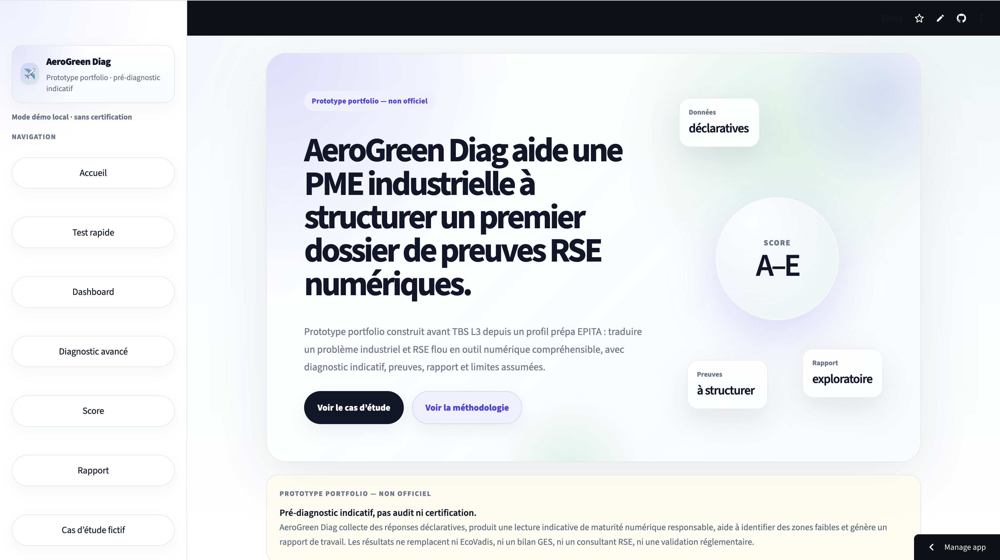
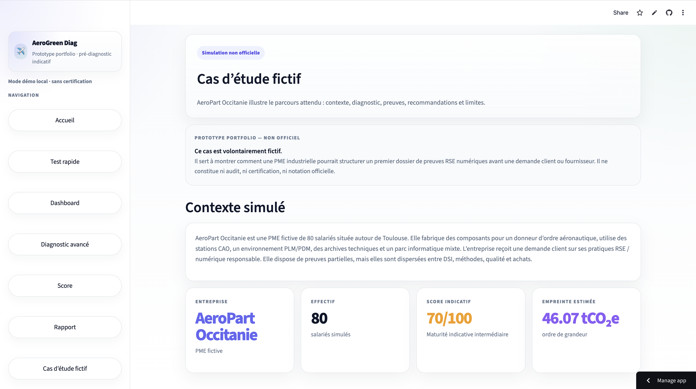
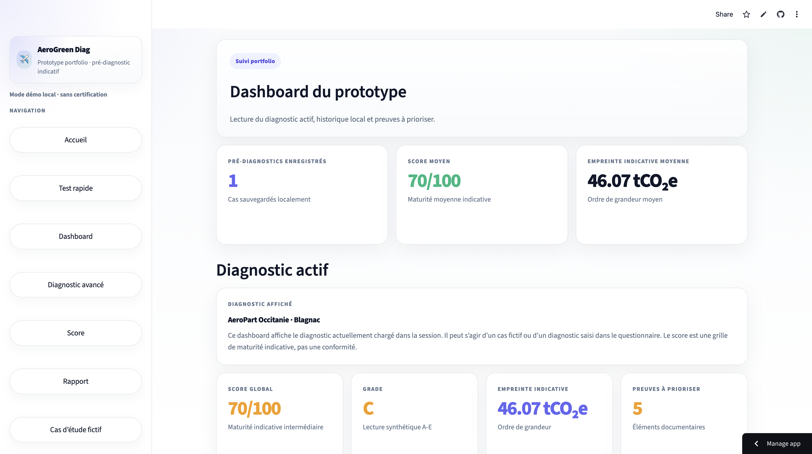
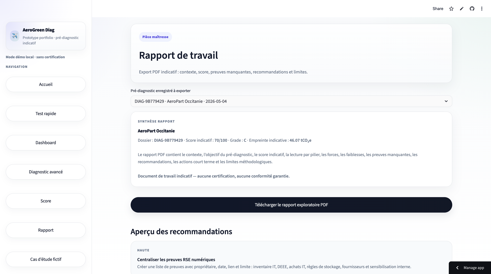

# AeroGreen Diag

**AeroGreen Diag** est un prototype portfolio qui aide une PME industrielle à structurer un premier dossier de preuves RSE numériques avant une demande client, fournisseur ou interne.

Le projet simule un pré-diagnostic de maturité numérique responsable pour une PME industrielle / sous-traitant aéronautique, avec un score indicatif, une lecture par piliers, une matrice de preuves, des recommandations et un rapport PDF exploitable.

> Ce projet n’est pas une startup, pas un SaaS commercial, pas une certification, pas un audit carbone réglementaire et pas un concurrent d’EcoVadis.  
> Il s’agit d’un démonstrateur portfolio conçu pour montrer une capacité à relier produit, tech, business, RSE, industrie et UX.

---

## Objectif du projet

AeroGreen Diag a été conçu comme un projet personnel / portfolio stratégique avant mon entrée à TBS en L3, à partir d’un profil prépa EPITA.

L’objectif est de démontrer ma capacité à :

- cadrer un problème B2B concret ;
- comprendre une cible industrielle locale ;
- transformer un sujet métier complexe en outil numérique structuré ;
- construire une interface Streamlit claire ;
- produire un diagnostic indicatif ;
- organiser des preuves RSE numériques ;
- générer un rapport synthétique ;
- assumer les limites méthodologiques d’un prototype ;
- articuler tech, business, industrie, RSE et storytelling produit.

---

## Problème métier simulé

Une PME industrielle ou un sous-traitant aéronautique peut recevoir une demande client ou fournisseur concernant ses pratiques RSE, son numérique responsable ou la gestion de ses équipements et données numériques.

Dans ce contexte, l’entreprise peut avoir des pratiques existantes, mais peu formalisées :

- inventaire informatique partiel ;
- règles d’archivage peu documentées ;
- achats IT sans critères responsables explicites ;
- données CAO / PLM stockées sans politique claire ;
- preuves RSE dispersées entre plusieurs services.

AeroGreen Diag propose une première lecture indicative pour aider à structurer ces éléments avant une discussion interne, une demande client ou un questionnaire fournisseur.

---

## Ce que le projet n’est pas

AeroGreen Diag ne doit pas être interprété comme :

- un audit carbone réglementaire ;
- une certification officielle ;
- une évaluation EcoVadis ;
- une conformité REEN ;
- un outil de calcul d’empreinte carbone réelle ;
- un conseil RSE professionnel ;
- une solution SaaS prête à être vendue ;
- un outil remplaçant un consultant, un auditeur ou un expert métier.

Le projet s’inspire de logiques de structuration de preuves et de maturité observées dans des démarches RSE, numériques responsables ou questionnaires fournisseurs, sans reproduire ni remplacer un référentiel officiel.

---

## Cas d’étude fictif

Le projet inclut un cas d’étude fictif : **AeroPart Occitanie**.

Profil simulé :

- PME industrielle fictive ;
- environ 80 salariés ;
- sous-traitant aéronautique de rang 2 ;
- située autour de Toulouse ;
- utilisation de données techniques, CAO et PLM ;
- parc informatique mixte ;
- pratiques RSE numériques partiellement formalisées ;
- pression client croissante sur les preuves environnementales et numériques.

Ce cas d’étude sert de scénario de démonstration pour comprendre rapidement l’usage du prototype sans devoir remplir tout le diagnostic manuellement.

---

## Fonctionnalités principales

- Page d’accueil avec clarification du positionnement portfolio.
- Diagnostic rapide pour une première lecture.
- Diagnostic avancé par piliers.
- Dashboard de maturité avec score global et scores détaillés.
- Cas d’étude fictif préchargé.
- Matrice Question → Preuve attendue → Recommandation.
- Génération d’un rapport PDF.
- Page Méthodologie & limites.
- Note stratégique expliquant les choix de conception.

---

## Aperçu visuel

### Page d’accueil



### Cas d’étude fictif



### Dashboard



### Rapport PDF



---

## Exemple de rapport

Un exemple de rapport généré à partir du cas fictif **AeroPart Occitanie** est disponible ici :

[Voir le rapport exemple](assets/sample_report/AeroGreen_Rapport_Exemple.pdf)

Le rapport synthétise :

- le contexte du diagnostic ;
- le score global indicatif ;
- la lecture par pilier ;
- les forces observées ;
- les fragilités principales ;
- les preuves à rassembler ;
- les recommandations prioritaires ;
- les limites méthodologiques.

---

## Démo en 3 minutes

Parcours recommandé pour comprendre le projet rapidement :

1. Lire la page d’accueil pour comprendre le positionnement.
2. Ouvrir le cas d’étude fictif.
3. Charger le cas dans la session.
4. Consulter le dashboard.
5. Lire le score par pilier.
6. Ouvrir la matrice de preuves et recommandations.
7. Générer ou consulter le rapport PDF.
8. Lire la page Méthodologie & limites.

Objectif de la démo :

> Montrer comment un problème métier flou peut être transformé en outil numérique structuré, avec une logique de diagnostic, une organisation des preuves, un rapport final et des limites assumées.

---

## Méthodologie

Le diagnostic repose sur une grille indicative organisée autour de plusieurs piliers :

- maturité carbone numérique ;
- gouvernance numérique responsable ;
- gestion des données techniques / CAO / PLM ;
- achats IT responsables ;
- capacité à structurer des preuves.

Le score obtenu est déclaratif et indicatif.

Il ne mesure pas l’empreinte carbone réelle de l’entreprise.  
Il donne une lecture de maturité permettant d’identifier les sujets prioritaires, les preuves manquantes et les actions simples à engager.

---

## Exemples de preuves RSE numériques

Le projet met l’accent sur la capacité d’une PME à organiser des preuves concrètes, par exemple :

- inventaire du parc informatique ;
- politique d’achat IT ;
- factures d’équipements reconditionnés ;
- procédure DEEE ;
- politique d’archivage ;
- cartographie des outils CAO / PLM ;
- règles de conservation des données techniques ;
- suivi des équipements numériques ;
- contrat fournisseur numérique ;
- preuve de sensibilisation interne ;
- documentation de sobriété numérique ;
- politique de stockage cloud ou on-premise.

L’objectif n’est pas de certifier ces preuves, mais de montrer comment une PME pourrait commencer à les structurer.

---

## Limites assumées

Le projet assume plusieurs limites :

- le score est indicatif et déclaratif ;
- les données ne sont pas vérifiées par un auditeur ;
- l’outil ne calcule pas une empreinte carbone réelle ;
- le projet ne reproduit pas EcoVadis, REEN ou un référentiel officiel ;
- les recommandations servent à structurer une première discussion, pas à garantir une conformité ;
- le cas d’étude est fictif ;
- les pondérations sont pédagogiques et non scientifiques.

Ces limites sont volontaires : le projet est un démonstrateur portfolio, pas un outil métier certifié.

---

## Ce que ce projet démontre

Ce projet démontre ma capacité à :

- partir d’un problème B2B concret ;
- formuler une cible professionnelle crédible ;
- construire un parcours utilisateur complet ;
- structurer une grille de maturité ;
- relier des réponses utilisateur à des preuves attendues ;
- produire un rapport synthétique exploitable ;
- développer une application Streamlit fonctionnelle ;
- organiser une logique de scoring ;
- documenter les limites d’un prototype ;
- relier des compétences techniques à une problématique business et industrielle.

---

## Stack technique

- Python
- Streamlit
- SQLite
- Pandas
- ReportLab / génération PDF
- HTML / CSS intégré à Streamlit
- Architecture modulaire par pages et composants

---

## Structure du projet

```txt
aerogreen-diag/
├── app.py
├── README.md
├── requirements.txt
├── .gitignore
├── assets/
│   ├── screenshots/
│   │   ├── home.png
│   │   ├── case-study.png
│   │   ├── dashboard.png
│   │   └── report.png
│   └── sample_report/
│       └── AeroGreen_Rapport_Exemple.pdf
├── core/
│   ├── scoring.py
│   ├── recommendations.py
│   └── sample_case.py
├── data/
├── docs/
│   └── strategic_note.md
├── pages_app/
│   ├── home.py
│   ├── case_study.py
│   ├── dashboard.py
│   ├── diagnostic.py
│   ├── score.py
│   ├── report.py
│   └── methodology.py
└── styles/
    └── css.py
